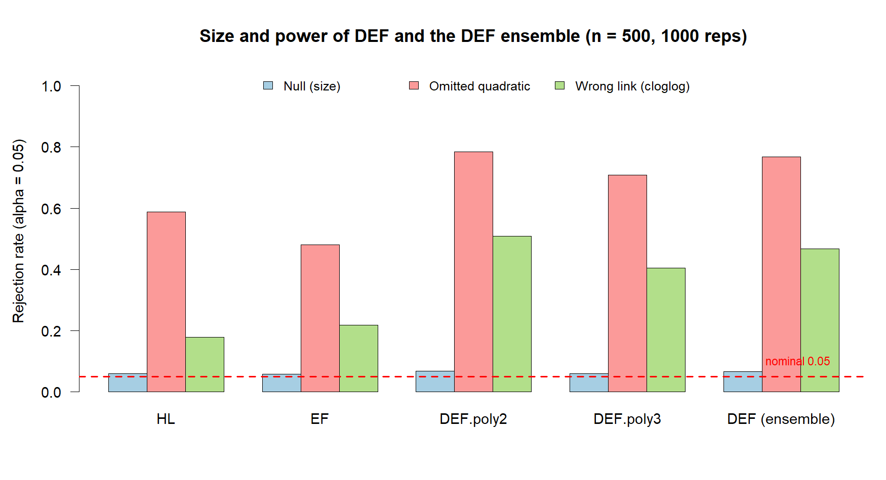
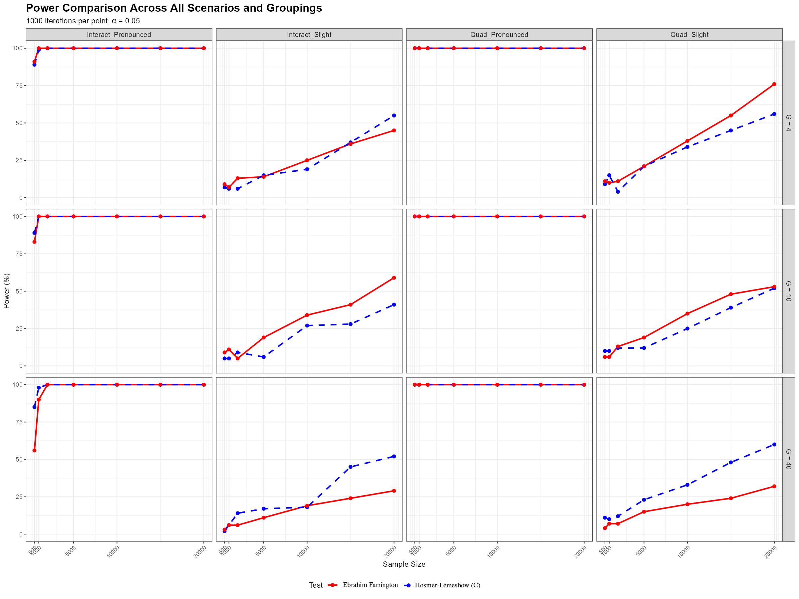
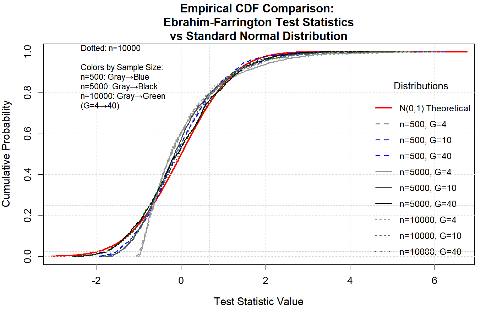
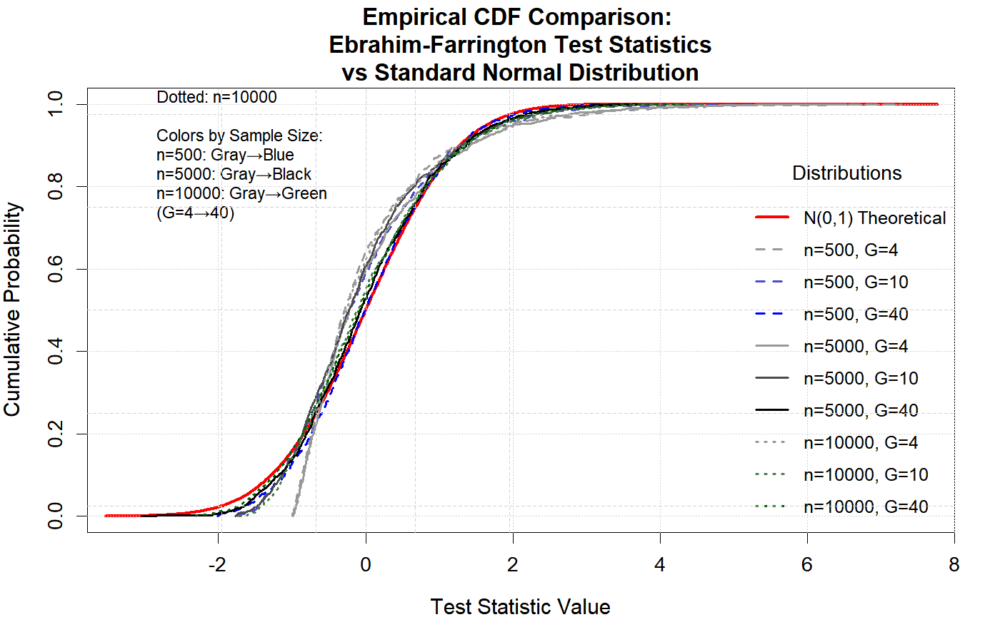

# Ebrahim-Farrington Goodness of Fit test


## Overview

The **ebrahim.gof** package implements the Ebrahim-Farrington goodness-of-fit test for logistic regression models. This test is particularly effective for binary data and sparse datasets, providing an improved alternative to the traditional Hosmer-Lemeshow test.

**New in version 2.0.0:** the package is now a full goodness-of-fit toolkit. Alongside the omnibus Ebrahim-Farrington (EF) test it adds the **Directed EF (DEF)** test (`def.gof()`), a **Cauchy-combination ensemble** (`def.ensemble.gof()`), and **`run.all.gof()`** — a one-call battery of ~19 goodness-of-fit tests (plus opt-in slow tests), each verified against the implementation used in the thesis simulation.

## Key Features

- **Ebrahim-Farrington Test** (`ef.gof()`): omnibus test for binary data with automatic grouping (chi-square or normal reference)
- **Directed EF Test** (`def.gof()`): targets calibration-shape departures (poly2/poly3/stukel bases or their ensemble)
- **Ensemble** (`def.ensemble.gof()`): combines the DEF bases via the Cauchy combination test
- **One-shot battery** (`run.all.gof()`): runs ~19 GOF tests (plus opt-in slow ones) and returns a tidy data frame
- **Original Farrington Test**: Full implementation for grouped data
- **Robust Performance**: Particularly effective with sparse data and binary outcomes
- **Well Documented**: Comprehensive documentation with examples

## Installation

### From GitHub (Development Version) 
Copy and paste this in R or R-studio.
```r
# Install devtools if you haven't already
if (!requireNamespace("devtools", quietly = TRUE)) {
  install.packages("devtools")
}

# Install ebrahim.gof from GitHub
devtools::install_github("ebrahimkhaled/ebrahim.gof")
```


### From CRAN (Stable Version) (_NOT AVAILABLE YET_)

Another way to install the R library, but it is _not available yet_.
```r
# Will be available after CRAN submission
install.packages("ebrahim.gof")
```

## Quick Start

```r
library(ebrahim.gof)

# Example with binary data
set.seed(123)
n <- 500
x <- rnorm(n)
linpred <- 0.5 + 1.2 * x
prob <- 1 / (1 + exp(-linpred))
y <- rbinom(n, 1, prob)

# Fit logistic regression
model <- glm(y ~ x, family = binomial())
predicted_probs <- fitted(model)

# Perform Ebrahim-Farrington test
result <- ef.gof(y, predicted_probs, G = 10)
print(result)
```

## Main Functions

### `ef.gof()`

The main function that performs the goodness-of-fit test:

```r
ef.gof(y, predicted_probs, G = 10, model = NULL, m = NULL,
       method = c("chisq", "normal"))
```

**Parameters:**
- `y`: a fitted binary-logistic `glm` (then `predicted_probs` is taken from it), or a binary response vector (0/1) / success counts for grouped data
- `predicted_probs`: Vector of predicted probabilities from logistic model
- `G`: Number of groups for binary data (default: 10)
- `method`: reference distribution for the grouped statistic. `"chisq"` (default, new in 2.0.0) refers T_EF to a chi-square with G-2 df; `"normal"` uses the standardized Z_EF (the behaviour of versions <= 1.0.0)
- `model`: Optional glm object (required for the original Farrington test only)
- `m`: Optional vector of trial counts (for grouped data; original Farrington only)

> **Note (breaking change in 2.0.0):** `ef.gof()` now defaults to `method = "chisq"`. Use `method = "normal"` to reproduce p-values from version 1.0.0.

**Returns:**
A data frame with test name, test statistic, and p-value.

### `def.gof()` — Directed Ebrahim-Farrington test

Concentrates power on calibration-curve shape directions by projecting the
grouped residuals onto a small smooth basis.

```r
def.gof(object, predicted_probs = NULL, X = NULL, G = 10,
        basis = c("poly3", "poly2", "stukel", "ensemble"),
        method = c("satterthwaite", "imhof"))
```

- `object`: a fitted binary-logistic `glm`, or a 0/1 response vector `y` (then give `predicted_probs`, and `X` to get the exact calibration).
- `basis`: `"poly3"` (default), `"poly2"`, `"stukel"`, or `"ensemble"` (runs all three and combines them via `def.ensemble.gof()`).
- `method`: `"satterthwaite"` (default, no extra dependency) or `"imhof"` (exact, needs `CompQuadForm`).

```r
fit <- glm(y ~ x1 + x2, family = binomial())
def.gof(fit)                      # default poly3 basis
def.gof(fit, basis = "ensemble")  # combined Cauchy decision
```

### `def.ensemble.gof()` — combine the DEF bases

Combines the three DEF basis tests (optionally the omnibus EF, or extra
p-values) into one decision via the Cauchy combination test (CCT).

```r
def.ensemble.gof(fit)                # CCT of poly2 + poly3 + stukel
def.ensemble.gof(fit, add_ef = TRUE) # add the omnibus EF
```

### `run.all.gof()` — the whole battery in one call

Runs a large battery of goodness-of-fit tests and returns one tidy data frame
(one row per test). A failing test never aborts the run.

```r
fit <- glm(low ~ age + lwt + factor(race), data = MASS::birthwt, family = binomial())
run.all.gof(fit)                       # the default (fast) battery + ensemble rows
run.all.gof(fit, include_slow = TRUE)  # also the opt-in slow tests
run.all.gof(fit, tests = c("EF", "DEF.poly3", "HL"))   # a chosen subset
run.all.gof(y, fitted(fit))            # prediction-only tests (no model)
```

Default battery (19 rows): Pearson, Deviance, Osius-Rojek, Copas-RSS,
Information-Matrix, Hosmer-Lemeshow (deciles and equal-width), Pigeon-Heyse, EF,
EF-normal, the three DEF bases, Stukel, Tsiatis, Xie, Pulkstenis-Robinson, and
the two Cauchy-combination ensemble rows. With `include_slow = TRUE` it also runs
le Cessie-van Houwelingen, the GAM-based tests (HL-GAM, PR-GAM, Xie-GAM; need
`mgcv`), Stute-Zhu, eHL, BAGofT, and the Lai & Liu standardized-power HL test.
Every test reproduces the implementation used in the original thesis simulation.

## Power and size: DEF and the DEF ensemble

The directed tests are designed to be **powerful without being liberal**. In a
quick Monte Carlo (n = 500, 1000 replications, α = 0.05) the DEF bases and their
ensemble hold the nominal size under a correctly specified model, yet detect
misspecification far more often than the Hosmer–Lemeshow (HL) test or the omnibus
EF test:

| Test | Size (null model) | Power: omitted quadratic | Power: wrong link (cloglog) |
|---|:---:|:---:|:---:|
| Hosmer–Lemeshow | 0.060 | 0.588 | 0.179 |
| EF (omnibus) | 0.058 | 0.480 | 0.218 |
| DEF (poly2) | 0.068 | 0.784 | 0.509 |
| DEF (poly3) | 0.060 | 0.709 | 0.404 |
| **DEF (ensemble)** | **0.066** | **0.767** | **0.468** |

The size stays around the nominal 0.05 for every test — the directed tests **do
not over-reject** (they are not liberal) — while DEF and the ensemble are markedly
more powerful, roughly **2–3× the power of HL** on the wrong-link scenario and
clearly ahead on the omitted-quadratic scenario.



*Setup: covariate `x ~ Uniform(-3, 3)`, models fitted as `glm(y ~ x)`; the null
is a correct logit model, the power scenarios omit a quadratic term and fit a
logit when the truth is complementary log-log. Computed with the package's own
`ef.gof()`, `def.gof()`, and `def.ensemble.gof()`.*

## Examples

### Example 1: Basic Usage with Binary Data

```r
library(ebrahim.gof)

# Simulate binary data
set.seed(42)
n <- 1000
x1 <- rnorm(n)
x2 <- rnorm(n)
linpred <- -0.5 + 0.8 * x1 + 0.6 * x2
prob <- plogis(linpred)
y <- rbinom(n, 1, prob)

# Fit logistic regression
model <- glm(y ~ x1 + x2, family = binomial())
predicted_probs <- fitted(model)

# Test goodness of fit (chi-square reference by default in 2.0.0;
# use method = "normal" for the version 1.0.0 p-value)
result <- ef.gof(y, predicted_probs, G = 10)
print(result)
#>                 Test Test_Statistic p_value
#> 1 Ebrahim-Farrington         1.3731   0.096
```

### Example 2: Compare Different Group Numbers

```r
# Test with different numbers of groups
results <- data.frame(
  Groups = c(4, 10, 20),
  P_value = c(
    ef.gof(y, predicted_probs, G = 4)$p_value,
    ef.gof(y, predicted_probs, G = 10)$p_value,
    ef.gof(y, predicted_probs, G = 20)$p_value
  )
)
print(results)
```

### Example 3: Comparison with Hosmer-Lemeshow Test

```r
library(ResourceSelection)

# Ebrahim-Farrington test
ef_result <- ef.gof(y, predicted_probs, G = 10)

# Hosmer-Lemeshow test
hl_result <- hoslem.test(y, predicted_probs, g = 10)

# Compare results
comparison <- data.frame(
  Test = c("Ebrahim-Farrington", "Hosmer-Lemeshow"),
  P_value = c(ef_result$p_value, hl_result$p.value)
)
print(comparison)
```

### Example 4: Power Analysis

```r
# Function to simulate misspecified model
simulate_power <- function(n, beta_quad = 0.1, n_sims = 100) {
  rejections <- 0
  
  for (i in 1:n_sims) {
    x <- runif(n, -2, 2)
    # True model has quadratic term
    linpred_true <- 0 + x + beta_quad * x^2
    prob_true <- plogis(linpred_true)
    y <- rbinom(n, 1, prob_true)
    
    # Fit misspecified linear model
    model_mis <- glm(y ~ x, family = binomial())
    pred_probs <- fitted(model_mis)
    
    # Test goodness of fit
    test_result <- ef.gof(y, pred_probs, G = 10)
    
    if (test_result$p_value < 0.05) {
      rejections <- rejections + 1
    }
  }
  
  return(rejections / n_sims)
}

# Calculate power for different sample sizes
power_results <- data.frame(
  n = c(100, 200, 500, 1000),
  power = sapply(c(100, 200, 500, 1000), simulate_power)
)
print(power_results)
```

## Methodology

The Ebrahim-Farrington test is based on Farrington's (1996) theoretical framework but simplified for practical implementation with binary data. The test uses a modified Pearson chi-square statistic:

For binary data with automatic grouping, the test statistic is:

```
Z_EF = (T_EF - (G - 2)) / sqrt(2(G - 2))
```

Where:
- `T_EF` is the modified Pearson chi-square statistic
- `G` is the number of groups
- `Z_EF` follows a standard normal distribution under H₀

As of **version 2.0.0**, `ef.gof()` by default refers `T_EF` directly to a
chi-square distribution with `G - 2` degrees of freedom (`method = "chisq"`),
which is a more accurate small-sample reference; the standardized-normal form
`Z_EF` above is still available via `method = "normal"`.

## Advantages over Hosmer-Lemeshow Test

1. **Better Power**: More sensitive to model misspecification
2. **Sparse Data Handling**: Specifically designed for sparse data situations
3. **Computational Efficiency**: Simplified calculations for binary data
4. **Theoretical Foundation**: Based on rigorous asymptotic theory
## Superior Performance at G=10
Simulation results consistently demonstrate that the Ebrahim-Farrington test outperforms the Hosmer-Lemeshow test, even when the model misspecification is minimal—such as with a missing interaction or omitted quadratic term—when using **G = 10** groups (Ebrahim, 2025).


## Asymptotically Following the Standard Normal Distribution
The following two figures illustrate that, under the null hypothesis, the Ebrahim-Farrington test statistic is asymptotically standard normal for both single-predictor and multiple-predictor logistic regression models. This property holds even in sparse data settings, confirming the theoretical foundation of the test and supporting its use for model assessment. (see (Ebrahim,2025))

- **Figure 1:** Empirical cumulative distribution function (CDF) of the Ebrahim-Farrington test statistic under the null for a single predictor, compared to the standard normal CDF.
- **Figure 2:** Empirical CDF for the test statistic under the null for a multiple independent predictors scenario, again compared to the standard normal.

These results demonstrate that the Ebrahim-Farrington test maintains the correct type I error rate and its statistic converges to the standard normal distribution as sample size increases, validating its asymptotic properties.




## References

1. Farrington, C. P. (1996). On Assessing Goodness of Fit of Generalized Linear Models to Sparse Data. *Journal of the Royal Statistical Society. Series B (Methodological)*, 58(2), 349-360.

2. Ebrahim, Khaled Ebrahim (2025). Goodness-of-Fits Tests and Calibration Machine Learning Algorithms for Logistic Regression Model with Sparse Data. *Master's Thesis*, Alexandria University.

3. Hosmer, D. W., & Lemeshow, S. (2000). Applied Logistic Regression, Second Edition. New York: Wiley.

## Citation

If you use this package in your research, please cite:

```
Ebrahim, K. E. (2025). ebrahim.gof: Ebrahim-Farrington Goodness-of-Fit Test 
for Logistic Regression. R package version 2.0.0. 
https://github.com/ebrahimkhaled/ebrahim.gof
```

## Contributing

Contributions are welcome! Please feel free to submit a Pull Request. For major changes, please open an issue first to discuss what you would like to change.

## License

This project is licensed under the GPL-3 License

## Author

**Ebrahim Khaled Ebrahim**  
Alexandria University  
Email: ebrahimkhaled@alexu.edu.eg

## Acknowledgments

- Prof. Osama Abd ElAziz Hussien (Alexandria University) for supervision
- Dr. Ahmed El-Kotory (Alexandria University) for  guidance and supervision
- The R community for continuous support and feedback 