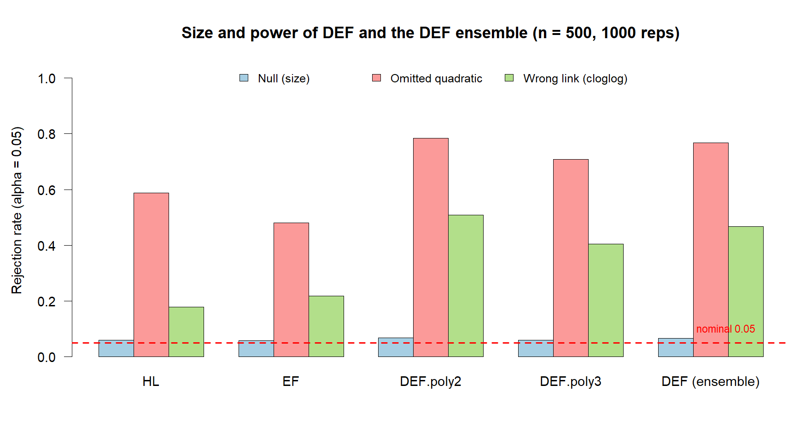
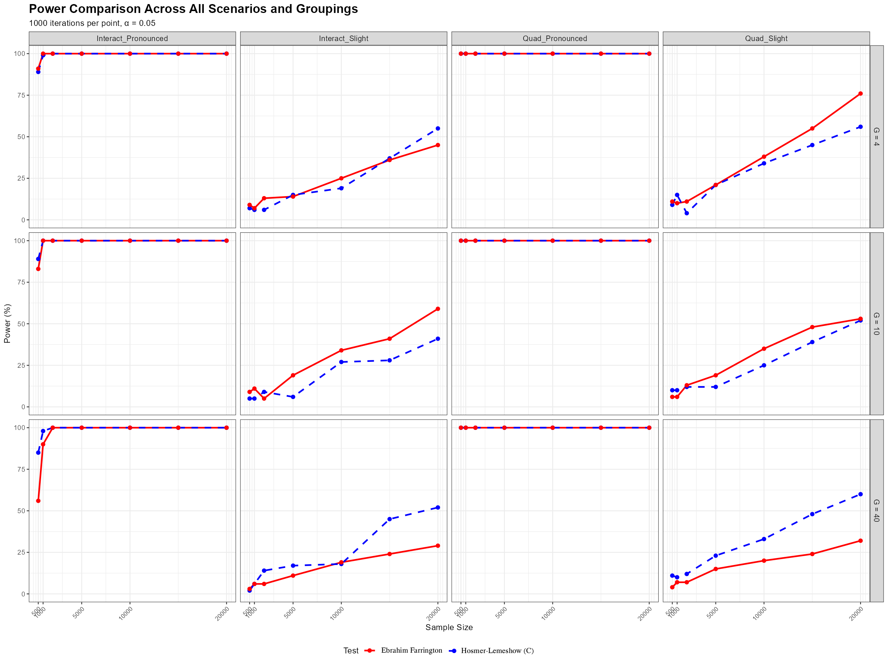
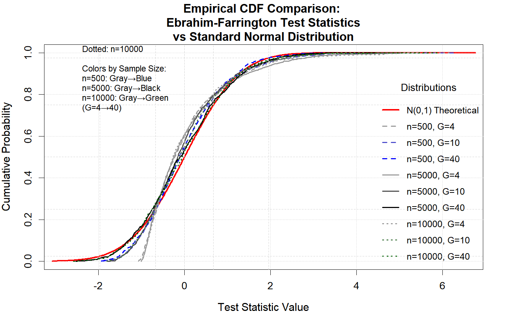
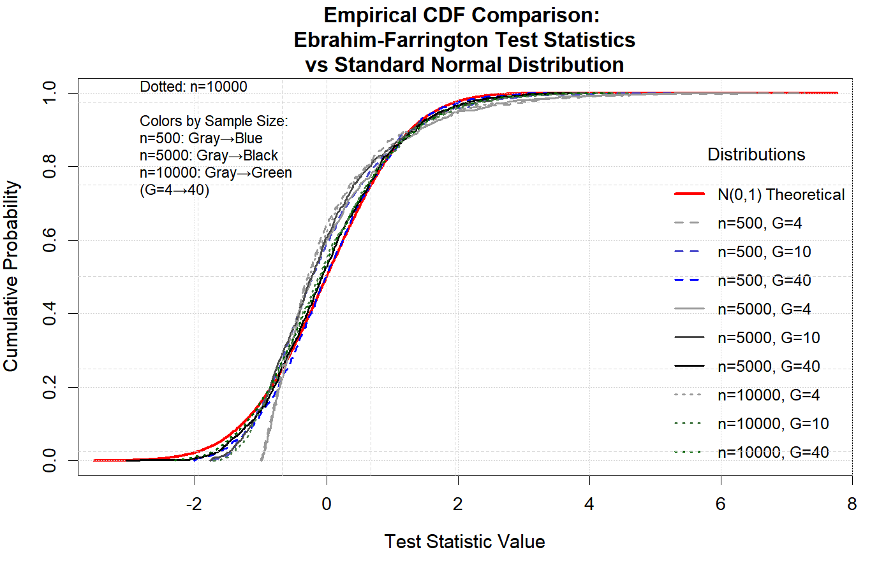

# ebrahim.gof — Goodness-of-Fit and Calibration Tests for Logistic Regression


## Overview

**ebrahim.gof** is a unified **toolbox** of goodness-of-fit and calibration tests for binary logistic
regression, callable in a single line via **`run.all.gof()`**. It is particularly suited to **sparse data**,
where the traditional Hosmer-Lemeshow test loses power.

The package **introduces the author's own sparse-data tests** — the omnibus **Ebrahim-Farrington (EF)** test
(`ef.gof()`), the **Directed EF / EDGE** test (`def.gof()` / `edge.gof()`) that targets smooth
calibration-shape departures, and a **Cauchy-combination ensemble** (`def.ensemble.gof()`) — and **aggregates
a wide range of classical and modern tests for comparison** (Hosmer-Lemeshow, McCullagh, Osius-Rojek,
le Cessie-van Houwelingen, Stute-Zhu, the binary-adaptive `BAGofT` test, and the `GiViTI` calibration test),
each obtained from its own package where installed and attributed to its authors.

See the vignette *"A goodness-of-fit and calibration toolbox for logistic regression"*
(`vignette("ebrahim-gof-toolbox", package = "ebrahim.gof")`) for a full walkthrough on the bundled
`gof_demo` dataset.

## Key Features

- **Ebrahim-Farrington Test** (`ef.gof()`): omnibus test for binary data with automatic grouping (chi-square or normal reference)
- **Directed EF Test** (`def.gof()`): targets calibration-shape departures (poly2/poly3/stukel bases or their ensemble)
- **Ensemble** (`def.ensemble.gof()`): combines the DEF bases via the Cauchy combination test
- **One-shot battery** (`run.all.gof()`): runs ~20+ GOF & calibration tests (plus opt-in slow ones) and returns a tidy data frame
- **Original Farrington Test**: Full implementation for grouped data
- **Robust Performance**: Particularly effective with sparse data and binary outcomes
- **Well Documented**: Comprehensive documentation with examples

## Installation

> **New here? Start with these two lines.**
> ```r
> install.packages("ebrahim.gof")   # core battery — nothing else needed
> library(ebrahim.gof)              # on load, it tells you if any optional
>                                   # packages are missing and how to add them
> ```
> The **core battery runs out of the box** (only `parallel` + `stats` are required).
> A few *slow* tests (GAM, `BAGofT`, `GiViTI`, Lai–Liu–HL) need optional packages —
> when they are missing, `library(ebrahim.gof)` prints a one-time hint, and you can
> install them all at once with **`gof_install_suggests()`**. Missing packages are
> never installed silently, and any test whose package is absent is simply skipped
> with a note (nothing errors).

### From GitHub (Development Version) 
Copy and paste this in R or R-studio.
```r
# Install devtools if you haven't already
if (!requireNamespace("devtools", quietly = TRUE)) {
  install.packages("devtools")
}

# Install ebrahim.gof from GitHub
devtools::install_github("ebrahimkhaled/ebrahim.gof")
```


### From CRAN (Stable Version)

The released version is on CRAN:
```r
install.packages("ebrahim.gof")
```
Version **2.4.0** — with the directed EDGE test, the Cauchy-combination ensemble,
the one-call battery, and forwarded `BAGofT` partition controls — is available
from GitHub now and is being submitted to CRAN.

## Quick Start

```r
library(ebrahim.gof)

# Example with binary data
set.seed(123)
n <- 500
x <- rnorm(n)
linpred <- 0.5 + 1.2 * x
prob <- 1 / (1 + exp(-linpred))
y <- rbinom(n, 1, prob)

# Fit logistic regression
model <- glm(y ~ x, family = binomial())
predicted_probs <- fitted(model)

# Perform Ebrahim-Farrington test
result <- ef.gof(y, predicted_probs, G = 10)
print(result)
```

## Main Functions

### `ef.gof()`

The main function that performs the goodness-of-fit test:

```r
ef.gof(y, predicted_probs, G = 10, model = NULL, m = NULL,
       method = c("chisq", "normal"))
```

**Parameters:**
- `y`: a fitted binary-logistic `glm` (then `predicted_probs` is taken from it), or a binary response vector (0/1) / success counts for grouped data
- `predicted_probs`: Vector of predicted probabilities from logistic model
- `G`: Number of groups for binary data (default: 10)
- `method`: reference distribution for the grouped statistic. `"chisq"` (default, new in 2.0.0) refers T_EF to a chi-square with G-2 df; `"normal"` uses the standardized Z_EF (the behaviour of versions <= 1.0.0)
- `model`: Optional glm object (required for the original Farrington test only)
- `m`: Optional vector of trial counts (for grouped data; original Farrington only)

> **Note (breaking change in 2.0.0):** `ef.gof()` now defaults to `method = "chisq"`. Use `method = "normal"` to reproduce p-values from version 1.0.0.

**Returns:**
A data frame with test name, test statistic, and p-value.

### `def.gof()` — Directed Ebrahim-Farrington test

Concentrates power on calibration-curve shape directions by projecting the
grouped residuals onto a small smooth basis.

```r
def.gof(object, predicted_probs = NULL, X = NULL, G = 10,
        basis = c("poly3", "poly2", "stukel", "ensemble"),
        method = c("satterthwaite", "imhof"))
```

- `object`: a fitted binary-logistic `glm`, or a 0/1 response vector `y` (then give `predicted_probs`, and `X` to get the exact calibration).
- `basis`: `"poly3"` (default), `"poly2"`, `"stukel"`, or `"ensemble"` (runs all three and combines them via `def.ensemble.gof()`).
- `method`: `"satterthwaite"` (default, no extra dependency) or `"imhof"` (exact, needs `CompQuadForm`).

```r
fit <- glm(y ~ x1 + x2, family = binomial())
def.gof(fit)                      # default poly3 basis
def.gof(fit, basis = "ensemble")  # combined Cauchy decision
```

### `def.ensemble.gof()` — combine the DEF bases

Combines the three DEF basis tests (optionally the omnibus EF, or extra
p-values) into one decision via the Cauchy combination test (CCT).

```r
def.ensemble.gof(fit)                # CCT of poly2 + poly3 + stukel
def.ensemble.gof(fit, add_ef = TRUE) # add the omnibus EF
```

### `run.all.gof()` — the whole battery in one call

Runs a large battery of goodness-of-fit tests and returns one tidy data frame
(one row per test). A failing test never aborts the run.

```r
fit <- glm(low ~ age + lwt + factor(race), data = MASS::birthwt, family = binomial())
run.all.gof(fit)                       # the default (fast) battery + ensemble rows
run.all.gof(fit, include_slow = TRUE)  # also the opt-in slow tests
run.all.gof(fit, tests = c("EF", "DEF.poly3", "HL"))   # a chosen subset
run.all.gof(y, fitted(fit))            # prediction-only tests (no model)
```

Default battery (19 rows): Pearson, Deviance, Osius-Rojek, Copas-RSS,
Information-Matrix, Hosmer-Lemeshow (deciles and equal-width), Pigeon-Heyse, EF,
EF-normal, the three DEF bases, Stukel, Tsiatis, Xie, Pulkstenis-Robinson, and
the two Cauchy-combination ensemble rows. With `include_slow = TRUE` it also runs
le Cessie-van Houwelingen, the GAM-based tests (HL-GAM, PR-GAM, Xie-GAM; need
`mgcv`), Stute-Zhu, eHL, BAGofT, and the Lai & Liu standardized-power HL test.
Every test reproduces the implementation used in the original thesis simulation.

### Optional packages for the slow tests

The slow tests rely on a few optional packages (`givitiR` + `callr` for the
GiViTI calibration test and belt, `mgcv` for the GAM tests, `BAGofT`,
`ResourceSelection`). They are not required to install `ebrahim.gof`; a test
whose package is missing is simply skipped with a note. CRAN policy forbids a
package from installing anything on its own, so `ebrahim.gof` never does that
silently. Instead, in an **interactive** session `run.all.gof()` offers to
install any missing package it needs (the default `install = "ask"`), and you
can install them all up front at any time:

```r
gof_install_suggests()                 # asks, then installs only the missing ones
gof_install_suggests(update = TRUE)    # also update any that are out of date
gof_install_suggests(ask = FALSE)      # install without a prompt (setup scripts)

run.all.gof(fit, include_slow = TRUE)               # asks to install if needed
run.all.gof(fit, include_slow = TRUE, install = "no")  # never ask, just skip
```

In a non-interactive session (scripts, `R CMD check`) nothing is ever installed,
regardless of the `install` setting.

## Power and size: the partition-based family

Most goodness-of-fit tests for logistic regression are **partition-based**: they
split the data into groups — by the fitted probability, by covariate-space
clusters, or by categorical patterns — and compare observed with expected event
counts in each group. This is the family that `ef.gof()`, `def.gof()`, and
`def.ensemble.gof()` belong to. In a Monte Carlo study (n = 500, 1000 replications,
α = 0.05) the partition tests compare as follows:

| Test | Grouping | Size (null) | Power: quadratic | Power: wrong link |
|---|---|:---:|:---:|:---:|
| Hosmer–Lemeshow (decile) | fitted prob | 0.060 | 0.588 | 0.179 |
| Hosmer–Lemeshow (equal-width) | fitted prob | 0.053 | 0.332 | 0.244 |
| Pigeon–Heyse | fitted prob | 0.035 | 0.535 | 0.133 |
| EF (omnibus) | fitted prob | 0.058 | 0.480 | 0.218 |
| Tsiatis | covariate clusters | 0.056 | 0.574 | 0.162 |
| Xie | covariate clusters | 0.042 | 0.557 | 0.147 |
| DEF (poly3) | fitted prob + shape basis | 0.060 | 0.709 | 0.404 |
| **DEF (ensemble, vote)** | fitted prob + 3 bases | **0.066** | **0.767** | **0.468** |

Across the family, **DEF and its vote ensemble are the most powerful while keeping
the size near the nominal 0.05** — they are not liberal — and they roughly double
the power of Hosmer–Lemeshow, Tsiatis, and Xie on the wrong-link misfit.



### Pros and cons of partition-based tests

**Pros**
- Intuitive — compare observed vs expected event counts within groups.
- Work for **sparse data and continuous covariates**, where the classical Pearson
  and deviance chi-square tests break down (those need replicated covariate
  patterns).
- Widely used and understood (Hosmer–Lemeshow is the de-facto standard).
- Flexible — group by the fitted probability (HL, EF, Pigeon–Heyse, DEF) or by the
  covariate space (Tsiatis, Xie) to target different kinds of misfit.

**Cons**
- The result depends on the **grouping choice** — the number of groups `G` and the
  grouping rule. Hosmer–Lemeshow in particular is known to give different answers
  for different `G` and across software.
- **Limited power for some departures** — omnibus partition tests (HL) spread their
  few degrees of freedom thinly; fitted-probability grouping can miss misfit that
  cancels along the predicted probability; covariate-clustering tests can miss
  smooth link departures.
- The chi-square reference is **asymptotic** and needs adequate group sizes.

DEF is built to fix the power cons **without** giving up size control: it keeps the
intuitive fitted-probability grouping but *directs* the test at calibration-curve
shapes, and the ensemble removes the basis choice by combining those directions —
which is why it tops the table above while staying at the nominal size.

*Setup: covariate `x ~ Uniform(-3, 3)`, models fitted as `glm(y ~ x)`; all tests
computed in one call with the package's own `run.all.gof()`. The dashed red line
marks the nominal 0.05 size.*

## Examples

### Example 1: Basic Usage with Binary Data

```r
library(ebrahim.gof)

# Simulate binary data
set.seed(42)
n <- 1000
x1 <- rnorm(n)
x2 <- rnorm(n)
linpred <- -0.5 + 0.8 * x1 + 0.6 * x2
prob <- plogis(linpred)
y <- rbinom(n, 1, prob)

# Fit logistic regression
model <- glm(y ~ x1 + x2, family = binomial())
predicted_probs <- fitted(model)

# Test goodness of fit (chi-square reference by default in 2.0.0;
# use method = "normal" for the version 1.0.0 p-value)
result <- ef.gof(y, predicted_probs, G = 10)
print(result)
#>                 Test Test_Statistic p_value
#> 1 Ebrahim-Farrington         1.3731   0.096
```

### Example 2: Compare Different Group Numbers

```r
# Test with different numbers of groups
results <- data.frame(
  Groups = c(4, 10, 20),
  P_value = c(
    ef.gof(y, predicted_probs, G = 4)$p_value,
    ef.gof(y, predicted_probs, G = 10)$p_value,
    ef.gof(y, predicted_probs, G = 20)$p_value
  )
)
print(results)
```

### Example 3: Comparison with Hosmer-Lemeshow Test

```r
library(ResourceSelection)

# Ebrahim-Farrington test
ef_result <- ef.gof(y, predicted_probs, G = 10)

# Hosmer-Lemeshow test
hl_result <- hoslem.test(y, predicted_probs, g = 10)

# Compare results
comparison <- data.frame(
  Test = c("Ebrahim-Farrington", "Hosmer-Lemeshow"),
  P_value = c(ef_result$p_value, hl_result$p.value)
)
print(comparison)
```

### Example 4: Power Analysis

```r
# Function to simulate misspecified model
simulate_power <- function(n, beta_quad = 0.1, n_sims = 100) {
  rejections <- 0
  
  for (i in 1:n_sims) {
    x <- runif(n, -2, 2)
    # True model has quadratic term
    linpred_true <- 0 + x + beta_quad * x^2
    prob_true <- plogis(linpred_true)
    y <- rbinom(n, 1, prob_true)
    
    # Fit misspecified linear model
    model_mis <- glm(y ~ x, family = binomial())
    pred_probs <- fitted(model_mis)
    
    # Test goodness of fit
    test_result <- ef.gof(y, pred_probs, G = 10)
    
    if (test_result$p_value < 0.05) {
      rejections <- rejections + 1
    }
  }
  
  return(rejections / n_sims)
}

# Calculate power for different sample sizes
power_results <- data.frame(
  n = c(100, 200, 500, 1000),
  power = sapply(c(100, 200, 500, 1000), simulate_power)
)
print(power_results)
```

### Example 5: Run the whole battery at once (`run.all.gof`)

```r
library(ebrahim.gof)

# a model on the classic low-birth-weight data
fit <- glm(low ~ age + lwt + factor(race) + smoke,
           data = MASS::birthwt, family = binomial())

# every test in one tidy data frame (one row per test)
run.all.gof(fit)

# also run the opt-in slow tests (le Cessie, GAM-based, Stute-Zhu, eHL, BAGofT,
# Lai-Liu); set the bootstrap reps via control
run.all.gof(fit, include_slow = TRUE,
            control = list("Stute-Zhu" = list(B = 200)))

# or just a chosen subset
run.all.gof(fit, tests = c("EF", "DEF.poly3", "Tsiatis", "HL"))
```

### Example 6: Directed test and the ensemble (`def.gof`, `def.ensemble.gof`)

```r
set.seed(1)
n <- 800
x <- runif(n, -3, 3)
y <- rbinom(n, 1, 1 - exp(-exp(0.6 * x)))   # true link is complementary log-log
fit <- glm(y ~ x, family = binomial())       # fitted as logit (misspecified)

# the directed test with different shape bases
def.gof(fit, basis = "poly2")
def.gof(fit, basis = "stukel")

# the recommended default: combine the three bases with the Cauchy combination
# test (no basis to choose, valid size)
def.ensemble.gof(fit)
def.ensemble.gof(fit, add_ef = TRUE)   # also fold in the omnibus EF
```

## Methodology

The Ebrahim-Farrington test is based on Farrington's (1996) theoretical framework but simplified for practical implementation with binary data. The test uses a modified Pearson chi-square statistic:

For binary data with automatic grouping, the test statistic is:

```
Z_EF = (T_EF - (G - 2)) / sqrt(2(G - 2))
```

Where:
- `T_EF` is the modified Pearson chi-square statistic
- `G` is the number of groups
- `Z_EF` follows a standard normal distribution under H₀

As of **version 2.0.0**, `ef.gof()` by default refers `T_EF` directly to a
chi-square distribution with `G - 2` degrees of freedom (`method = "chisq"`),
which is a more accurate small-sample reference; the standardized-normal form
`Z_EF` above is still available via `method = "normal"`.

## Advantages over Hosmer-Lemeshow Test

1. **Better Power**: More sensitive to model misspecification
2. **Sparse Data Handling**: Specifically designed for sparse data situations
3. **Computational Efficiency**: Simplified calculations for binary data
4. **Theoretical Foundation**: Based on rigorous asymptotic theory
## Superior Performance at G=10
Simulation results consistently demonstrate that the Ebrahim-Farrington test outperforms the Hosmer-Lemeshow test, even when the model misspecification is minimal—such as with a missing interaction or omitted quadratic term—when using **G = 10** groups (Ebrahim, 2025).


## Asymptotically Following the Standard Normal Distribution
The following two figures illustrate that, under the null hypothesis, the Ebrahim-Farrington test statistic is asymptotically standard normal for both single-predictor and multiple-predictor logistic regression models. This property holds even in sparse data settings, confirming the theoretical foundation of the test and supporting its use for model assessment. (see (Ebrahim,2025))

- **Figure 1:** Empirical cumulative distribution function (CDF) of the Ebrahim-Farrington test statistic under the null for a single predictor, compared to the standard normal CDF.
- **Figure 2:** Empirical CDF for the test statistic under the null for a multiple independent predictors scenario, again compared to the standard normal.

These results demonstrate that the Ebrahim-Farrington test maintains the correct type I error rate and its statistic converges to the standard normal distribution as sample size increases, validating its asymptotic properties.




## Performance: parallel and GPU

The battery is fast by default — the author's own tests (`ef.gof()`, `edge.gof()`,
`def.ensemble.gof()`) are closed-form and run in **milliseconds**. The cost comes from
a few classical resampling/quadratic-form tests when they are included.

### Parallel bootstrap tests (built in)

Two of the slow tests — **Stute–Zhu** and **Lai–Liu–HL** — are bootstrap tests. Their
resampling loops can be spread across CPU cores with a single flag:

```r
# run just the bootstrap test on 4 workers
run.all.gof(fit, tests = "Stute-Zhu", parallel = TRUE, ncores = 4,
            control = list("Stute-Zhu" = list(B = 2000)))
```

- Uses a local **PSOCK cluster** from base R's `parallel` package — works on **all
  platforms, including Windows** (not just fork-based Unix).
- `ncores = NULL` (default) uses `detectCores() - 1`; values below 2 fall back to the
  sequential path.
- **Reproducible:** with `parallel::clusterSetRNGStream`, the same `set.seed()` and the
  same `ncores` give **identical** bootstrap *p*-values.
- Default is `parallel = FALSE`, so nothing changes unless you opt in. The gain is
  moderate (it targets the resampling loops only, and cluster setup has fixed overhead),
  so it pays off mainly at large `B`.

### Optional GPU path (replication scripts, not part of the package)

The most expensive **aggregated** tests — **le Cessie–van Houwelingen** and
**McCullagh** (dense O(n²)–O(n³) quadratic forms), plus the projection/RMEP bootstrap —
have GPU implementations (CuPy accessed via `reticulate`). These are **not shipped in the
package**: they need a CUDA + CuPy environment and would make the package non-portable, so
they live in the paper's replication scripts. Every GPU statistic is checked against the
CPU value to a relative tolerance of 1e-6 (identical, correct statistic — only faster):

| Test | n | CPU (s) | GPU (s) | Speed-up |
|---|---:|---:|---:|---:|
| le Cessie | 2000 | 14.81 | 0.20 | 74× |
| le Cessie | 5000 | 225.22 | 2.95 | 76× |
| McCullagh | 2000 | 14.54 | 0.03 | 485× |
| McCullagh | 5000 | 224.32 | 0.08 | **2804×** |
| projection (RMEP) | 1000 | 28.75 | 1.22 | 24× |

These accelerate the *classical rival* tests so they stay usable for large-*n*
comparisons; the package's own directed tests are already fast on one CPU core. Full
benchmark: `paper_JSS/replication/gpu_bench.R` and `gpu_bench.csv` (see the JSS
companion paper, §5).

## References

1. Farrington, C. P. (1996). On Assessing Goodness of Fit of Generalized Linear Models to Sparse Data. *Journal of the Royal Statistical Society. Series B (Methodological)*, 58(2), 349-360.

2. Ebrahim, Khaled Ebrahim (2025). Goodness-of-Fits Tests and Calibration Machine Learning Algorithms for Logistic Regression Model with Sparse Data. *Master's Thesis*, Alexandria University.

3. Hosmer, D. W., & Lemeshow, S. (2000). Applied Logistic Regression, Second Edition. New York: Wiley.

## Citation

If you use this package in your research, please cite it (run `citation("ebrahim.gof")`
in R for the up-to-date entries):

```
Ebrahim, E. K. (2026). ebrahim.gof: Goodness-of-Fit and Calibration Tests
for Logistic Regression. R package version 2.4.0.
https://github.com/ebrahimkhaled/ebrahim.gof
```

### Related papers

The methods in this package are described in the following papers by the author
(please cite the relevant one alongside the package):

- **EDGE — the directed test** (`edge.gof()` / `def.gof()`): Ebrahim, E. K. & El-Kotory, A. (2026).
  *EDGE: A Closed-Form Directed Goodness-of-Fit Test for Sparse Logistic Regression.* Manuscript.
- **EF — the omnibus test** (`ef.gof()`): Ebrahim, E. K. & El-Kotory, A. (2026).
  *A directional Hosmer–Lemeshow goodness-of-fit test for sparse logistic regression.*
  arXiv:2607.15454 · Zenodo [10.5281/zenodo.21184547](https://doi.org/10.5281/zenodo.21184547)
- **Benchmark — how the battery performs**: Ebrahim, E. K. & El-Kotory, A. (2026).
  *Benchmarking goodness-of-fit and calibration algorithms for logistic regression.*
  arXiv:2607.16344 · Zenodo [10.5281/zenodo.21286172](https://doi.org/10.5281/zenodo.21286172) —
  an empirical comparison of the tests aggregated here (no single test wins across all alternatives).
- **EDGES — the Cauchy-combination ensemble** (`edges.gof()` / `def.ensemble.gof()`):
  Ebrahim, E. K. & El-Kotory, A. (2026). *A Cauchy-combination ensemble of directed
  goodness-of-fit tests.* In preparation.

## Contributing

Contributions are welcome! Please feel free to submit a Pull Request. For major changes, please open an issue first to discuss what you would like to change.

## License

This project is licensed under the GPL-3 License

## Author

**Ebrahim Khaled Ebrahim**  
Alexandria University  
Email: ebrahimkhaled@alexu.edu.eg

## Acknowledgments

- Prof. Osama Abd ElAziz Hussien (Alexandria University) for supervision
- Dr. Ahmed El-Kotory (Alexandria University) for  guidance and supervision
- The R community for continuous support and feedback 
## Reproducing published results

The EDGE paper's benchmarks correspond to version 2.4.0 (the CRAN release accompanying
the papers). To install that exact version later, so the published examples reproduce
even after newer releases:

```r
remotes::install_version("ebrahim.gof", version = "2.4.0")
```
