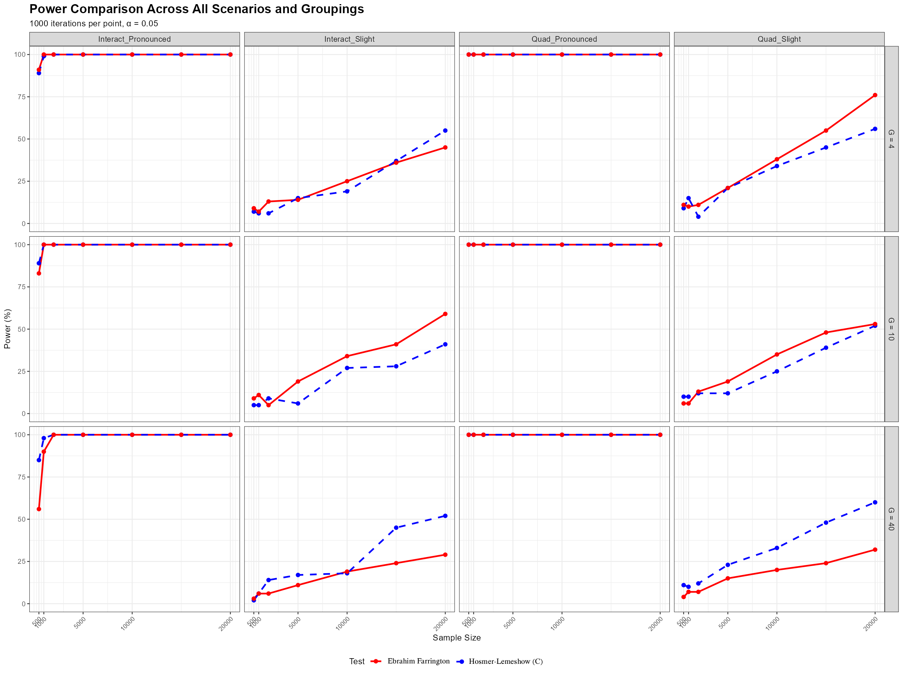

# Ebrahim-Farrington Goodness of Fit test

[](https://CRAN.R-project.org/package=ebrahim.gof)

[](https://www.gnu.org/licenses/gpl-3.0)

## Overview

The **ebrahim.gof** package implements the Ebrahim-Farrington goodness-of-fit test for logistic regression models. This test is particularly effective for binary data and sparse datasets, providing an improved alternative to the traditional Hosmer-Lemeshow test.

## Key Features

- **Ebrahim-Farrington Test**: Simplified implementation for binary data with automatic grouping
- **Original Farrington Test**: Full implementation for grouped data
- **Robust Performance**: Particularly effective with sparse data and binary outcomes
- **Easy to Use**: Simple function interface similar to other goodness-of-fit tests
- **Well Documented**: Comprehensive documentation with examples

## Installation

### From GitHub (Development Version) 
Copy and paste this in R or R-studio.
```r
# Install devtools if you haven't already
if (!requireNamespace("devtools", quietly = TRUE)) {
  install.packages("devtools")
}

# Install ebrahim.gof from GitHub
devtools::install_github("ebrahimkhaled/ebrahim.gof")
```


### From CRAN (Stable Version) (_NOT AVAILABLE YET_)

Another way to install the R-Libarary, but its _not avaialbe yet_.
```r
# Will be available after CRAN submission
install.packages("ebrahim.gof")
```

## Quick Start

```r
library(ebrahim.gof)

# Example with binary data
set.seed(123)
n <- 500
x <- rnorm(n)
linpred <- 0.5 + 1.2 * x
prob <- 1 / (1 + exp(-linpred))
y <- rbinom(n, 1, prob)

# Fit logistic regression
model <- glm(y ~ x, family = binomial())
predicted_probs <- fitted(model)

# Perform Ebrahim-Farrington test
result <- ef.gof(y, predicted_probs, G = 10)
print(result)
```

## Main Functions

### `ef.gof()`

The main function that performs the goodness-of-fit test:

```r
ef.gof(y, predicted_probs , G = 10, model = NULL, m = NULL)
```

**Parameters:**
- `y`: Binary response vector (0/1) or success counts for grouped data
- `predicted_probs`: Vector of predicted probabilities from logistic model
- `G`: Number of groups for binary data (default: 10)
- `model`: Optional glm object (required for original Farrington  only, not for Ebrahim-Farrington test)
- `m`: Optional vector of trial counts (for grouped data) (required for original Farrington  only, not for Ebrahim-Farrington test)


**Returns:**
A data frame with test name, test statistic, and p-value.

## Examples

### Example 1: Basic Usage with Binary Data

```r
library(ebrahim.gof)

# Simulate binary data
set.seed(42)
n <- 1000
x1 <- rnorm(n)
x2 <- rnorm(n)
linpred <- -0.5 + 0.8 * x1 + 0.6 * x2
prob <- plogis(linpred)
y <- rbinom(n, 1, prob)

# Fit logistic regression
model <- glm(y ~ x1 + x2, family = binomial())
predicted_probs <- fitted(model)

# Test goodness of fit
result <- ef.gof(y, predicted_probs, G = 10)
print(result)
#>              Test Test_Statistic   p_value
#> 1 Ebrahim-Farrington     -0.8944    0.8143
```

### Example 2: Compare Different Group Numbers

```r
# Test with different numbers of groups
results <- data.frame(
  Groups = c(4, 10, 20),
  P_value = c(
    ef.gof(y, predicted_probs, G = 4)$p_value,
    ef.gof(y, predicted_probs, G = 10)$p_value,
    ef.gof(y, predicted_probs, G = 20)$p_value
  )
)
print(results)
```

### Example 3: Comparison with Hosmer-Lemeshow Test

```r
library(ResourceSelection)

# Ebrahim-Farrington test
ef_result <- ef.gof(y, predicted_probs, G = 10)

# Hosmer-Lemeshow test
hl_result <- hoslem.test(y, predicted_probs, g = 10)

# Compare results
comparison <- data.frame(
  Test = c("Ebrahim-Farrington", "Hosmer-Lemeshow"),
  P_value = c(ef_result$p_value, hl_result$p.value)
)
print(comparison)
```

### Example 4: Power Analysis

```r
# Function to simulate misspecified model
simulate_power <- function(n, beta_quad = 0.1, n_sims = 100) {
  rejections <- 0
  
  for (i in 1:n_sims) {
    x <- runif(n, -2, 2)
    # True model has quadratic term
    linpred_true <- 0 + x + beta_quad * x^2
    prob_true <- plogis(linpred_true)
    y <- rbinom(n, 1, prob_true)
    
    # Fit misspecified linear model
    model_mis <- glm(y ~ x, family = binomial())
    pred_probs <- fitted(model_mis)
    
    # Test goodness of fit
    test_result <- ef.gof(y, pred_probs, G = 10)
    
    if (test_result$p_value < 0.05) {
      rejections <- rejections + 1
    }
  }
  
  return(rejections / n_sims)
}

# Calculate power for different sample sizes
power_results <- data.frame(
  n = c(100, 200, 500, 1000),
  power = sapply(c(100, 200, 500, 1000), simulate_power)
)
print(power_results)
```

## Methodology

The Ebrahim-Farrington test is based on Farrington's (1996) theoretical framework but simplified for practical implementation with binary data. The test uses a modified Pearson chi-square statistic:

For binary data with automatic grouping, the test statistic is:

```
Z_EF = (T_EF - (G - 2)) / sqrt(2(G - 2))
```

Where:
- `T_EF` is the modified Pearson chi-square statistic
- `G` is the number of groups
- The test statistic follows a standard normal distribution under H₀

## Advantages over Hosmer-Lemeshow Test

1. **Better Power**: More sensitive to model misspecification
2. **Sparse Data Handling**: Specifically designed for sparse data situations
3. **Computational Efficiency**: Simplified calculations for binary data
4. **Theoretical Foundation**: Based on rigorous asymptotic theory
## Superior Performance at G=10
Simulation results consistently demonstrate that the Ebrahim-Farrington test outperforms the Hosmer-Lemeshow test, even when the model misspecification is minimal—such as with a missing interaction or omitted quadratic term—when using **G = 10** groups (Ebrahim, 2025).


## Assympotitically Following the Standard Normal Distn
The following two figures illustrate that, under the null hypothesis, the Ebrahim-Farrington test statistic is asymptotically standard normal for both single-predictor and multiple-predictor logistic regression models. This property holds even in sparse data settings, confirming the theoretical foundation of the test and supporting its use for model assessment. (see (Ebrahim,2025))

- **Figure 1:** Empirical cumulative distribution function (CDF) of the Ebrahim-Farrington test statistic under the null for a single predictor, compared to the standard normal CDF.
- **Figure 2:** Empirical CDF for the test statistic under the null for a multiple independent predictors scenario, again compared to the standard normal.

These results demonstrate that the Ebrahim-Farrington test maintains the correct type I error rate and its statistic converges to the standard normal distribution as sample size increases, validating its asymptotic properties.

.png)
.png)

## References

1. Farrington, C. P. (1996). On Assessing Goodness of Fit of Generalized Linear Models to Sparse Data. *Journal of the Royal Statistical Society. Series B (Methodological)*, 58(2), 349-360.

2. Ebrahim, Khaled Ebrahim (2025). Goodness-of-Fits Tests and Calibration Machine Learning Algorithms for Logistic Regression Model with Sparse Data. *Master's Thesis*, Alexandria University.

3. Hosmer, D. W., & Lemeshow, S. (2000). Applied Logistic Regression, Second Edition. New York: Wiley.

## Citation

If you use this package in your research, please cite:

```
Ebrahim, K. E. (2025). ebrahim.gof: Ebrahim-Farrington Goodness-of-Fit Test 
for Logistic Regression. R package version 1.0.0. 
https://github.com/ebrahimkhaled/ebrahim.gof
```

## Contributing

Contributions are welcome! Please feel free to submit a Pull Request. For major changes, please open an issue first to discuss what you would like to change.

## License

This project is licensed under the GPL-3 License - see the [LICENSE](LICENSE) file for details.

## Author

**Ebrahim Khaled Ebrahim**  
Alexandria University  
Email: ebrahim.khaled@alexu.edu.eg

## Acknowledgments

- Prof. Osama Abd ElAziz Hussien (Alexandria University) for supervision
- Dr. Ahmed El-Kotory (Alexandria University) for  guidance and supervision
- The R community for continuous support and feedback 